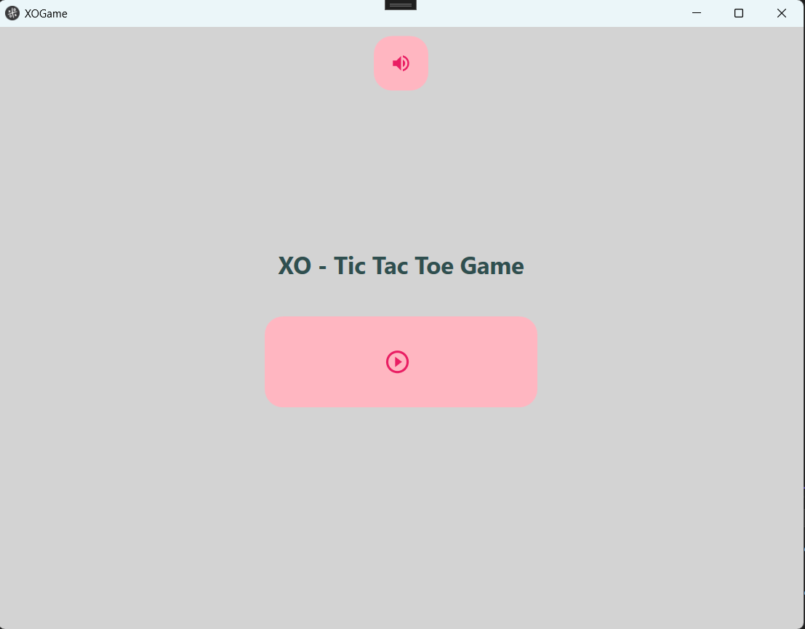
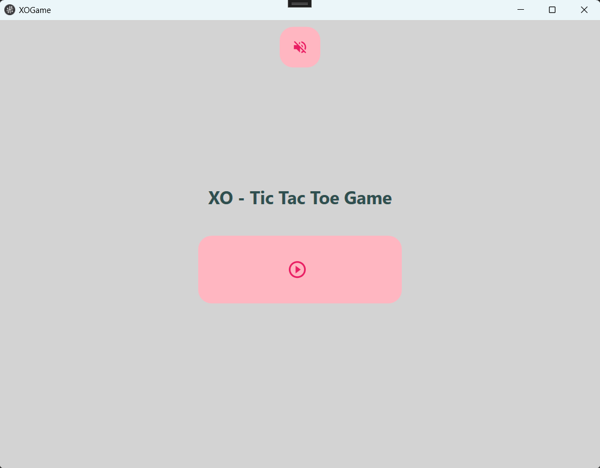
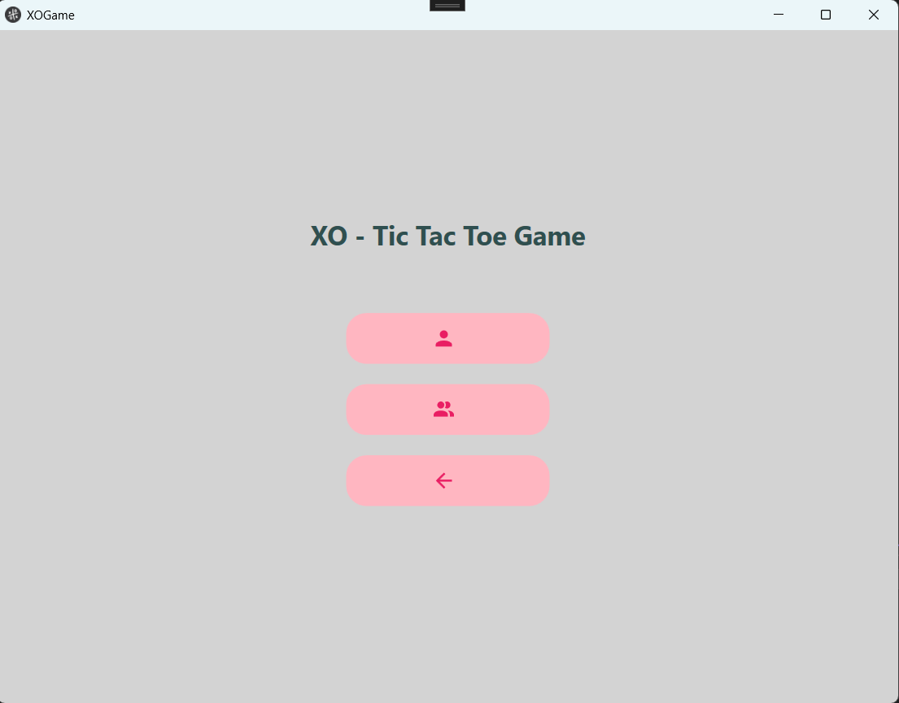
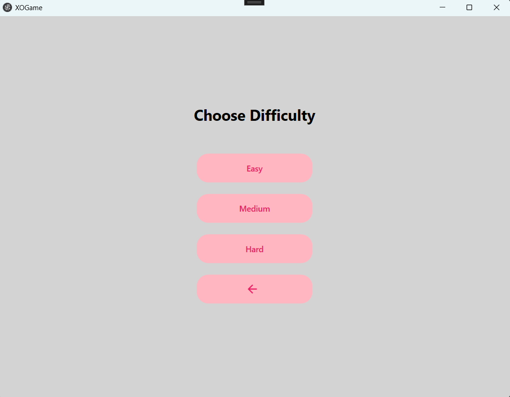
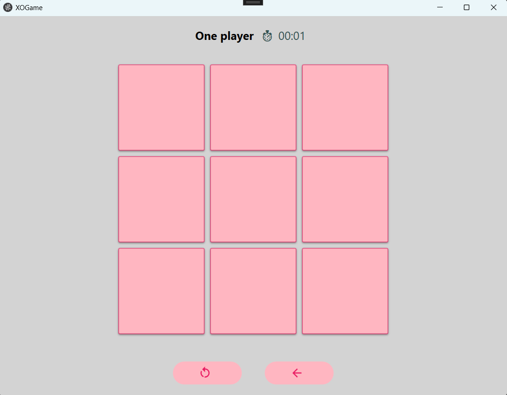
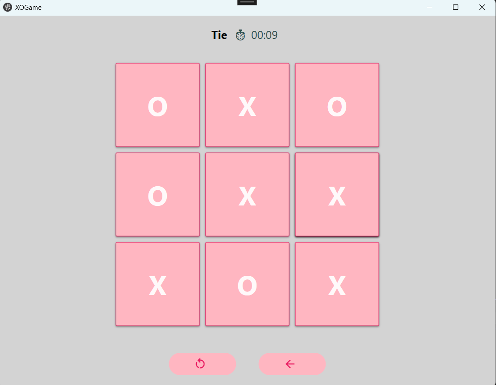

# 🎮 XO game
## Description
When the user starts the game, they are given the option to choose whether to play solo or with another player. If the user selects the "Single Player" mode, a new window appears where they can choose one of three difficulty levels: easy, medium, or hard. During the match, the game time is automatically tracked. The user can restart the game at any time, and they can also navigate back through the application's previous screens. Additionally, the user has the option to turn off the music if they find it distracting.

## Screenshots

